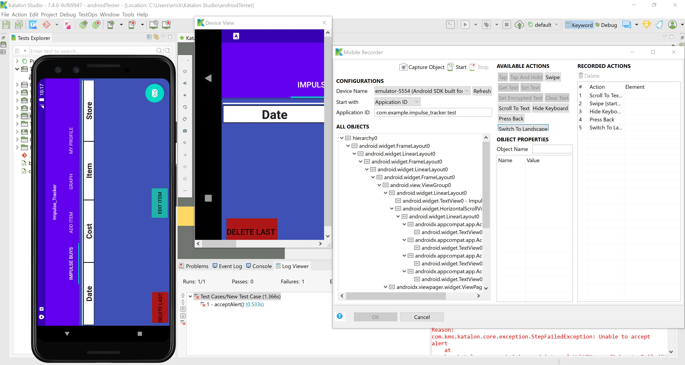

# D7 Verification and Validation

## Introduction 
The value proposition of our software is to help users build healthier spending habits that prevent Regret, impulse, under-planning
and unsustainable purchases. And our software will be a mobile phone application which built by Android Studio. Each user can have a account that record the goods they have purchased or want to purchase in the future. This app will allow for the user(s) to enter, update, and delete purchases that they have made, these purchases will help construct a graph of te users purchase history to help with healthier spending habits and promote more financial stability.

## Verification(tests)
### Unit Tests
#### Test Framework Used: 
We used JUnit for the unit tests.

#### Link to GitHub folder with automated unit tests:
[Link to folder](https://github.com/CS386-ImpulseTracker/MobileApp/blob/Stage_VerificationAndValidation/ImpulseApp/app/src/test/java/com/example/impulseapp/ChangeTextBehaviorTest.java)
#### Test Case Using Mock Objects and Link: 
This test was type in an item and add it to the list.
[Link(https://github.com/CS386-ImpulseTracker/MobileApp/blob/Stage_VerificationAndValidation/ImpulseApp/app/src/test/java/com/example/impulseapp/ChangeTextBehaviorTest.java)]

#### Testing Framework Used:
We used JUnit testing for the integration tests.

#### A print screen: 

In this test we tested a DummyContent object and initialized some data in it. We then asserted that the information was returned correctly.

#### Integration Test Example and Link:
In this test file we are testing the add item tab in the table on the impulse buys screen. 
We are also testing the delete last in the impulse buys section of the application.
[Link(https://github.com/CS386-ImpulseTracker/MobileApp/blob/Stage_VerificationAndValidation/bailey_newest_impulse_tracker/app/src/androidTest/java/com/example/impulse_tracker/MainActivityTests.java)] 

#### A print screen: 
   

### Acceptance Tests
#### Test Framework Used:
Katalon

#### Link to GitHub folder with automated acceptance tests:
Katalon did not save anything for automated acceptance tests, this is very difficult stuff to learn by yourself and my group has not really been helping 

#### Acceptance Test Example:
I just tested the basic things that were lready part of the Katalon app that were scrolling, rotation, clicking, and swiping tabs.

#### A Print Screen/Video:
   

## Validation

### Script:
#### Actions:
Open up the application.\
Toggle over to the ‘ADD ITEM’ Tab.\
Add an item or two to the list.\
Toggle back to the ‘IMPULSE BUYS’ Tab.\
Look at the purchases you have made and you can scroll up and down.\
Click the ‘DELETE LAST’ button and the most recent entry will delete.\
Click the ‘ EDIT ITEM’ button and you can change an item by its index(UNFINISHED).\
Toggle to the ‘GRAPH’ Tab this is where the graph of purchase would be(UNFINISHED).\
Toggle to the ‘USER PROFILE’ Tab this is where you would be able to look at your information and edit it (UNFINISHED).

##### Interview Questions:
What do you think about our app even though it is unfinished?

Do you think you would use it if it was a finished project?

What do you think about the user interface?

Do you think that this would help you track unhealthy spending habits if it was complete?

Would seeing your unhealthy habits tracked out on a graph help you limit your impulse spending?

What would you like to see this app become?

### Results:
#### Bailey's Interview with Kenny:
##### What do you think about our app even though it is unfinished?
“I like the basis of the application it seems very useful.” 
##### Do you think you would use it if it was a finished project?
"I would probably use it since im so terrible with my money right now."
##### What do you think about the user interface?
"I think it seems easy to use and simple to learn"
##### Do you think that this would help you track unhealthy spending habits if it was complete?
"I see it helping me but it might not work for everyone else"
##### Would seeing your unhealthy habits tracked out on a graph help you limit your impulse spending?
"It probably would help me out a bit seeing how much money I waste"
##### What would you like to see this app become?
"I'd want to really see it completed and become more of what you say it is going to be."

#### Bailey's Interview with Elie:
##### What do you think about our app even though it is unfinished?
"It looks a bit clunky and really unfinished."
##### Do you think you would use it if it was a finished project?
"I dont think that I would"
##### What do you think about the user interface?
"It looks simple enough."
##### Do you think that this would help you track unhealthy spending habits if it was complete?
“I think its a cool idea overall but it isn’t complete yet so I couldn’t tell you if I would really use it or not.” 
##### What would you like to see this app become?
"If you finished it a bit more I could maybe give you more insight."

#### Bailey's Interview with John:
##### What do you think about our app even though it is unfinished?
"It looks unfinished and unrefined."
##### Do you think you would use it if it was a finished project?
“The app is cool and if you finished it I would probably be willing to use it.” 
##### What do you think about the user interface?
" It looks easy to use but you should work on making it more inviting to the users."
##### Do you think that this would help you track unhealthy spending habits if it was complete?
"I feel like im good at spending my money but I thinkk it would help me just visualize where my money is going a bit better."
##### Would seeing your unhealthy habits tracked out on a graph help you limit your impulse spending?
"Like I said, I don't spend my money really unhealthily but I would like to be able to see a bit more of where my money is going."

#### Chenhao's Interview with Zane:
##### What do you think about our app even though it is unfinished?
"It needs more work to be finish."
##### Do you think you would use it if it was a finished project?
"Maybe I will use it."
##### What do you think about the user interface?
"It looks OK but not good."
##### Do you think that this would help you track unhealthy spending habits if it was complete?
“I think it could not help me as I seldom add items in mobile.” 
##### What would you like to see this app become?
"I think it maybe help some people who like online shopping."

### Reflections:
I think overall I got pretty positive feedback on what the app is as its unfinished shell of what it could be. The majority of the people I talked to had decent things to say and would likely use it. The 'add item' feature worked well as did the 'delete last'. We should add the ability to select items and edit them as well as select and delete them. The people that I talked to carried out the short list of tasks that I made out. I do believe that the users got the desired results from their actions because there really isn't a lot that can go wrong in this app. The users that I talked with seemed to like the easy to use interface with simple toggles between pages and simple fields and actions. I personally think that if the app was finished that it would accomplish our value propostion, but I think that right now as it stand only half finished it would not accomplish the value proposition.

